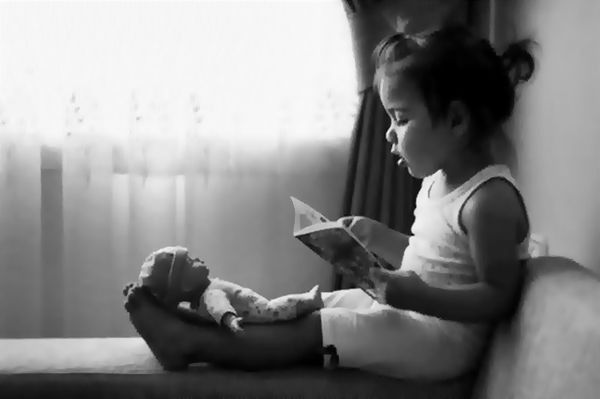
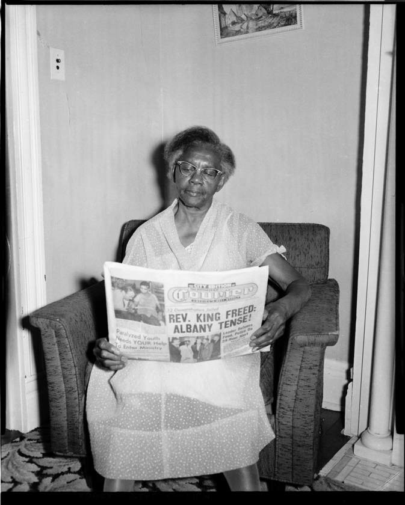
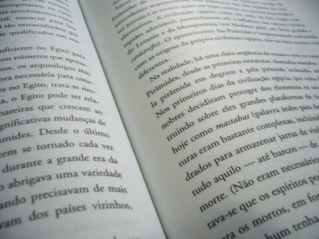
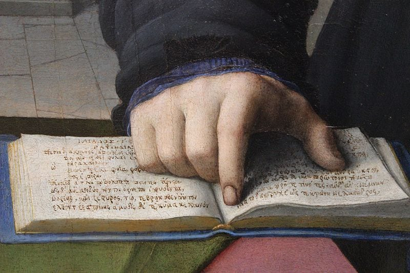
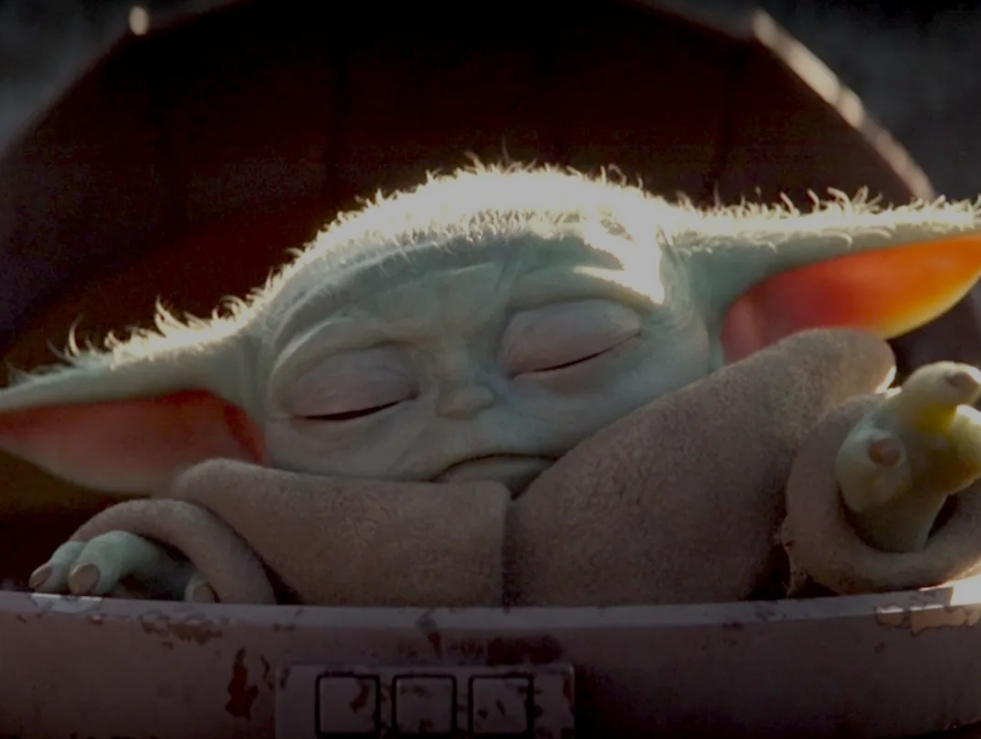
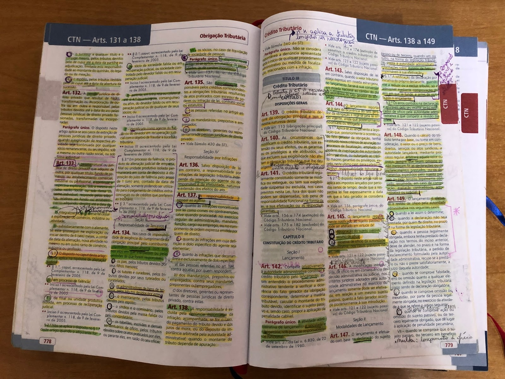
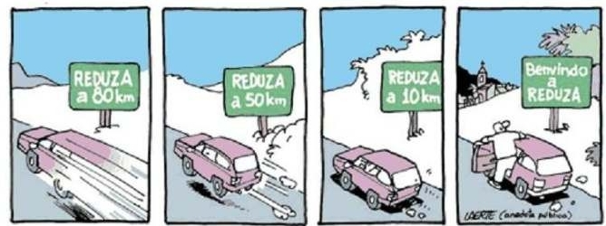

layout: true

---
class: middle, center
```{r setup, include=FALSE}
options(htmltools.dir.version = FALSE)

knitr::opts_chunk$set(
	echo = FALSE,
	fig.align = "center",
	message = FALSE,
	warning = FALSE,
	cache = FALSE
)
```

```{r eval=FALSE, include=FALSE}
library(knitr)
library(tidyverse)
library(widgetframe)
```
class: center, middle

# **Aula baseada no texto:**
<br>

## "Como Ler: sugestões para uma prática produtiva da leitura de José Carlos Bruni 

#### **(Professor do Departamento de Sociologia da USP. O texto é fruto de um Material didático distribuído em 1983, rediagramado e revisto por Ana Lúcia Schritzmeyer Profa. do Departamento de Antropologia, USP, 2004)**
<br>

## [CLIQUE PARA BAIXAR](https://drive.google.com/file/d/14JR4UfLxSg3lFdCycYXTW3w-lBbN4XZc/view?usp=sharing)

---
class: middle, center

## **Aprende-se a mecânica de ler aos sete anos de idade.**

```{r, out.width="80%"}

```
---
class: middle, center

### No entanto, **a leitura**, concebida como **instrumento de compreensão de uma idéia**, é processo bem mais complexo. Seu aprendizado não pode ser fixado em uma idade determinada e o aprimoramento da técnica de leitura é tarefa de toda uma vida.

```{r, out.width="43%"}

```
[Elderly woman holding Pittsburgh Courier newspaper with headline reading “Reverend King Freed: Albany Tense” seated in armchair - July 1962](https://collection.cmoa.org/objects/287afd0b-9769-4914-8a01-04e184a627b5) 
---
class: middle, center

## **A leitura é exercida sobre um TEXTO!**

```{r, out.width="75%"}

```

> "nome genérico para toda e qualquer porção de linguagem escrita. As dimensões do texto são variáveis. Textos podem ser: uma obra inteira, com vários volumes; um livro inteiro; uma
parte de um livro, com vários capítulos; um capítulo de um livro; às vezes, uma
página apenas, mas de conteúdo bastante rico."

---
class: middle, center

## **Nós vamos ler textos científicos das Ciências Humanas**

```{r, out.width="80%"}

```

> "caracterizado por um certo rigor de pensamento e expressão, uma certa ordem na concatenação das idéias e pela demonstração das afirmações, comporta uma leitura interna e uma análise externa. A leitura interna atém-se ao que o texto diz explicitamente. A análise externa utiliza dados que não aparecem no texto, mas que o explicam."

---
class: inverse, center, middle

# Qual é a **idéia básica** do texto?

---
class: middle, center

### Ler é, fundamentalmente, o ato de apropriação da **IDÉIA CENTRAL DO TEXTO**, isto é, da idéia principal, básica, que contém a essência do texto. 

```{r, out.width="75%"}

```

### Esse deve ser o princípio norteador de toda leitura. Todos os outros princípios estão subordinados a esse e devem contribuir para a sua realização.

---
class: middle, center

### A idéia básica **não está localizada em um ponto perfeitamente identificável do texto**. Não se constitui em uma ou duas frases do texto. A idéia básica anima o texto inteiro, podendo transparecer mais claramente em certas frases do que em outras. 

```{r, out.width="70%"}
knitr::include_graphics("https://media.giphy.com/media/1T3hgSrBYe6ek/source.gif")
```

### Há certos trechos mais “quentes”, em que certas frases são muito importantes. Mas a leitura desses trechos não é suficiente para produzir a idéia básica do texto.
---
class: inverse, center, middle

# 1ª Regra da técnica da leitura

---
class: inverse, center, middle


```{r, out.width="65%"}
knitr::include_graphics("https://media.giphy.com/media/l2SpXaJA67JaSqSxq/source.gif")
```

## Leia inicialmente o texto inteiro, para obter uma visão de conjunto, do todo.

---
class: middle, center

## Preste atenção apenas no que **mais se destaca**, deixando-se de lado os pormenores, o que não é essencial, como exemplos, repetições, dados ilustrativos etc.
<br>

```{r, out.width="65%"}
knitr::include_graphics("https://media.giphy.com/media/xUA7aWKRZJkUlBB6mc/giphy.gif")
```

---
class: middle, center

## Terminada essa primeira leitura, mais superficial, faça, mentalmente ou por escrito, um **apanhado geral de idéias que se revelaram mais importantes**, que mais chamaram a sua atenção. 

```{r, out.width="60%"}
knitr::include_graphics("https://media.giphy.com/media/dQpUkK59l5Imxsh8jN/source.gif")
```

---
class: middle, center

```{r, out.width="70%"}

```

## Tente fazer, sem consultar o texto novamente. Essa idéia geral servirá de guia para os passos restantes do trabalho de leitura.

---
class: inverse, center, middle

# 2ª Regra da técnica da leitura

---
class: inverse, center, middle

```{r, out.width="65%"}
knitr::include_graphics("https://media.giphy.com/media/l2SpXaJA67JaSqSxq/source.gif")
```

## Na segunda leitura, procurar identificar as partes do texto que contêm as **idéias secundárias**, bem como o modo como estão relacionadas.

---
class: middle, center

## Terminada a segunda leitura, retorne às suas anotações e complemente com as **ideias secundárias**. Se preferir, faça **desenhos e diagramas** para ajudar na memorização 

```{r, out.width="60%"}
knitr::include_graphics("https://media.giphy.com/media/JO4OozaZt5W4iblMhf/giphy.gif")
```

---
class: inverse, center, middle

# 3ª Regra da técnica da leitura

---
class: middle, center

## Uma terceira leitura do texto deve apreender os vários elementos componentes de suas diferentes partes: **os conceitos**, ou seja, as **idéias mais elementares de um texto**. 

```{r, out.width="60%"}
knitr::include_graphics("https://media.giphy.com/media/TlK63EPYTCOMhJal7u8/giphy.gif")
```

---
class: middle, center

```{r, out.width="60%"}
knitr::include_graphics("https://media.giphy.com/media/pO6VirqF04cgEUVbzS/giphy.gif")
```

## Os **conceitos** são como os **tijolos de uma casa**, assim como as partes corresponderiam a seus vários cômodos. A análise do texto deve chegar aos conceitos que o constituem.

---
class: center, middle

```{r, out.width="70%"}

```

## Trata-se de uma leitura mais cuidadosa e minuciosa. Não é necessário ter em mente, a cada momento, a idéia básica, mas deve-se tentar **compreender as minúcias das idéias**, ou antes, os elementos mínimos de que as idéias são formadas. 

---
class: middle, center

# A ideia central + deias secundárias + conceitos = **leitura interna** do texto 

```{r, out.width="70%"}
knitr::include_graphics("https://media.giphy.com/media/BWEY1LI6WdaN2/giphy.gif")
```

> "A leitura interna de um texto deve, portanto, captar sua idéia básica, sua estrutura e seus conceitos. Trata-se de um movimento que parte do mais geral, do mais global, para terminar no mais particular, no mais elementar."

---
class: inverse, middle, center

# "Em suma, **deve-se ler um texto científico três vezes**. A primeira leitura deve apreender a idéia básica, a segunda deve procurar as partes e sua concatenação e a terceira deve fixar os conceitos."

---
class: inverse, middle, center

# Calma que ainda falta uma última coisa!

```{r, out.width="60%"}
knitr::include_graphics("https://media0.giphy.com/media/CjmvTCZf2U3p09Cn0h/giphy-downsized.gif")
```
---
class: inverse, middle, center

# A análise externa do texto 

---
class: middle, center
## Todo texto está inserido em um **CONTEXTO**.

```{r, out.width="100%"}

```

## Ao contrário do texto, **o contexto é invisível**, isto é, não se apresenta diretamente ao leitor. O contexto deve ser **procurado, pesquisado, reconstruído**.

---
class: middle, center

# **Contexto lógico**

```{r, out.width="50%"}
knitr::include_graphics("https://media.giphy.com/media/jphuDUCPSsC10tEwo0/giphy.gif")
```

> "...elementos de ordem intelectual que envolvem o texto. Tudo aquilo que antecede logicamente o texto e que ele depende pode ser chamado de **PRESSUPOSTOS** do texto. Todas as consequências que o texto acarreta, tudo aquilo a que o texto nos leva, pode ser chamado de as **IMPLICAÇÕES** do texto"

---
class: middle, center

# **Contexto histórico**

```{r, out.width="75%"}
knitr::include_graphics("https://media.giphy.com/media/l0HlRincOBSIi5oxG/giphy.gif")
```

> "conjunto de acontecimentos — fatos de ordem política, econômica e social — que determinam o conteúdo do texto. Todo o texto tem uma data — a data de sua produção — que o marca como
**produto de uma história e de uma época**. O contexto histórico ilumina essa temporalidade do texto."

---
class: middle, center

# Obrigado gente!
<br>
<br>

.pull-left[
```{r, out.width="100%"}
knitr::include_graphics("https://media1.giphy.com/media/3oz8xIsloV7zOmt81G/giphy.gif")
```
]
.pull-right[
# **ATENÇÃO**:

Esta presentação será insuficiente sem a leitura integral do texto!

]

